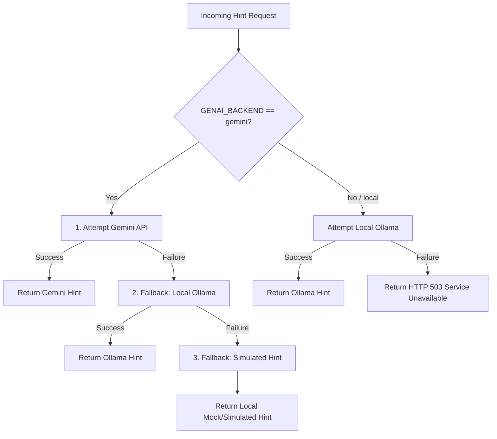

# GenAI Microservice

This directory contains the FastAPI-based **GenAI Microservice** that serves as the AI core of the AI Mock Interview Platform. It provides an API for generating contextual hints for technical interview questions.

---

## Architecture & Core Files

* **Main Application**: [main.py](file:///c:/Users/huhan/Documents/Projects/AI-Mock-Interview-Platform/genai/main.py)
* **Dependency Declarations**: [requirements.txt](file:///c:/Users/huhan/Documents/Projects/AI-Mock-Interview-Platform/genai/requirements.txt)
* **Container Build Instructions**: [Dockerfile](file:///c:/Users/huhan/Documents/Projects/AI-Mock-Interview-Platform/genai/Dockerfile)

---

## Inference Backends & Routing

The GenAI service supports two primary inference modes configurable via environment variables:

| Backend (`GENAI_BACKEND`) | Description | Configuration |
|---|---|---|
| `gemini` | Queries Google's Gemini API | Requires `GEMINI_API_KEY`. Uses model configured by `GENAI_MODEL`. |
| `local` | Queries a locally-hosted Ollama endpoint | Requires `LOCAL_MODEL_URL`. Defaults to the `llama3` model. |

### Resilient Fallback Strategy

When configured with `GENAI_BACKEND=gemini`, the service implements a nested fallback mechanism to preserve frontend user experience in the event of rate limits, network issues, or API failures:



1. **Gemini API (Primary)**: Queries Google's Gemini LLM.
2. **Local Ollama (Secondary)**: Fallback triggered on Gemini timeout or error.
3. **Simulated Hint (Tertiary)**: If both Gemini and local Ollama fail, the service dynamically generates a simulated hint based on the question text, role, and category, and successfully returns it to the client with `source="simulated"`.

*Note: If `GENAI_BACKEND` is set directly to `local`, no automated fallback chain to simulated hints is triggered; if the local Ollama instance is unreachable, it raises an HTTP 503 Service Unavailable exception.*

---

## Observability & Metrics

The service is fully instrumented to expose runtime telemetry to Prometheus:

1. **Auto-metrics Integration**: Using `prometheus_fastapi_instrumentator`, it records standard API metrics such as HTTP request counts, latency, and response status codes.
2. **Custom Routing Telemetry**: Exposes a custom metric called `genai_requests_total` partitioned by `backend` and `source` to monitor the distribution of inference requests and track the activation of fallbacks.

### Custom Prometheus Metric

* **Metric Name**: `genai_requests_total`
* **Type**: Counter
* **Labels**:
  - `backend`: The configured target backend (`gemini` or `local`).
  - `source`: The actual system that fulfilled the request (`gemini`, `local` fallback, or `simulated` fallback).
* **Usage**: Used to visualize model routing success rates and trace fallback triggers.

---

## Configuration & Environment Variables

These variables configure the FastAPI container. They can be set in the main [.env](file:///c:/Users/huhan/Documents/Projects/AI-Mock-Interview-Platform/.env) file at the root of the repository.

| Environment Variable | Default Value | Description |
|---|---|---|
| `GENAI_BACKEND` | `local` | Active AI backend (`gemini` or `local`). |
| `GEMINI_API_KEY` | *None* | Google Gemini API secret key. |
| `GENAI_MODEL` | `gemini-flash-lite-latest` | The Gemini model variant to invoke. |
| `LOCAL_MODEL_URL` | `http://localhost:11434/api/generate` | Endpoint URL of the local Ollama instance. |

---

## API Endpoints

### 1. Generate Hint
* **Endpoint**: `POST /generate-hint`
* **Request Body**:
  ```json
  {
    "question": "Implement a binary search tree insertion algorithm.",
    "role": "Software Engineer",
    "category": "Data Structures"
  }
  ```
* **Response Body**:
  ```json
  {
    "hint": "Start by comparing the insertion value with the root node to decide the traversal direction.",
    "source": "gemini"
  }
  ```

### 2. Health Check
* **Endpoint**: `GET /health`
* **Response Body**:
  ```json
  {
    "status": "ok",
    "backend": "gemini",
    "model": "gemini-flash-lite-latest",
    "has_key": true
  }
  ```

### 3. Prometheus Metrics
* **Endpoint**: `GET /metrics`
* **Response**: Raw Prometheus-formatted scrape metrics.

---

## Local Development (Without Docker)

### Prerequisites
- Python 3.9 or higher

### Setup & Launch

1. Navigate to this directory:
   ```bash
   cd genai
   ```
2. Create and activate a Python virtual environment:
   ```bash
   python -m venv venv
   # On Windows (PowerShell):
   .\venv\Scripts\Activate.ps1
   # On macOS/Linux:
   source venv/bin/activate
   ```
3. Install dependencies:
   ```bash
   pip install -r requirements.txt
   ```
4. Start the service using `uvicorn`:
   ```bash
   uvicorn main:app --host 0.0.0.0 --port 8000
   ```
5. Verify health:
   ```bash
   curl http://localhost:8000/health
   ```

---

## Testing & Verification

Detailed instructions to test metric gathering, fallback behaviors, and alerts in local and cluster environments:

### A. Local Environment Testing

#### 1. Setup & Traffic Generation
1. Launch the stack:
   ```bash
   docker compose up -d --build
   ```
2. Open `http://localhost:3000` (Frontend) and click **"Get Hint"** on multiple questions to trigger AI calls.

#### 2. Verify Metrics & Dashboards
* **Raw Metrics (Server)**: Go to `http://localhost:8080/actuator/prometheus` and verify `http_client_requests_seconds` is present.
* **Raw Metrics (GenAI)**: Go to `http://localhost:8000/metrics` and verify `genai_requests_total` is present.
* **Grafana Dashboard**: Open Grafana at `http://localhost:3001` (login: `admin` / `admin`). Navigate to the **AI Mock Interview Platform Observability** dashboard. Verify that the four panels at the bottom are updating correctly.

#### 3. Test Alerting Rules
Open the Prometheus alerts console at `http://localhost:9090/alerts`.
* **Testing `GenaiDown`**:
  1. Stop the GenAI container:
     ```bash
     docker compose stop genai
     ```
  2. Watch the `GenaiDown` alert status transition from **Inactive** to **Pending** and then to **Firing** in Prometheus (takes 30 seconds).
  3. Restart the container to restore health:
     ```bash
     docker compose start genai
     ```
* **Testing `GenaiHighErrorRate`**:
  1. Set `GENAI_BACKEND=gemini` and empty the `GEMINI_API_KEY` value in your `.env` file.
  2. Restart the GenAI container with the new configuration:
     ```bash
     docker compose up -d genai
     ```
  3. Go to the frontend and click **"Get Hint"** on questions.
  4. With no API key, the Gemini requests will fail. If Ollama is not running/unreachable, it will fallback to simulated hint.
  5. To force 5xx failures and trigger the warning, simulate connection errors or backend failures that raise exceptions in `main.py` causing the error rate alert to transition to **Firing** within 1 minute.

---

### B. Cluster Environment Testing (AET Cluster)

#### 1. Build and Push (Targeting AMD64 Nodes)
Since the cluster runs on x86_64/amd64 nodes, build targeting this architecture from your local machine:
```bash
docker login ghcr.io -u YOUR_GITHUB_USERNAME
docker build --platform linux/amd64 -t ghcr.io/devops26hn/ai-mock-interview-platform/server:latest ./server
docker push ghcr.io/devops26hn/ai-mock-interview-platform/server:latest
```

#### 2. Deploy (Default Values)
```bash
export KUBECONFIG=~/Downloads/kubeconfig.yaml
helm upgrade --install interview-app ./helm/interview-app \
  --namespace <tumid>-devops26 \
  --set tumid="<tumid>"
```

#### 3. Access Monitoring (Port Forwarding)
Start the port forwarding tunnels in separate terminals:
```bash
# Prometheus
kubectl port-forward svc/prometheus 9090:9090 -n <tumid>-devops26

# Grafana
kubectl port-forward svc/grafana 3000:3000 -n <tumid>-devops26
```

#### 4. Verify Alerts on the Cluster
1. Visit `http://localhost:9090/alerts` to check that `GenaiDown` and `GenaiHighErrorRate` are registered (status **Inactive**).
2. Scale the GenAI deployment down to zero:
   ```bash
   kubectl scale deployment/genai --replicas=0 -n <tumid>-devops26
   ```
3. Watch the `GenaiDown` alert turn red (**Firing**) on the Prometheus Alerts page. 
4. Restore the replica count afterwards:
   ```bash
   kubectl scale deployment/genai --replicas=1 -n <tumid>-devops26
   ```
